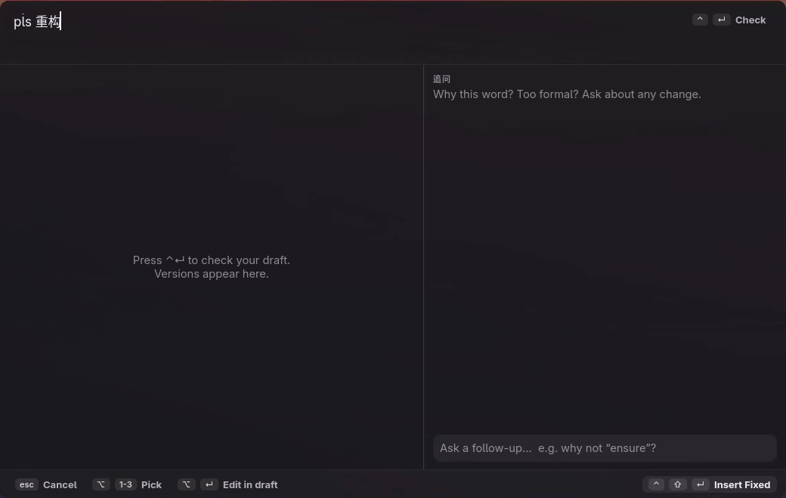

# saywell

Say it well: write English to AI coding agents with help, and learn from your own mistakes.



- `saywell`: reads a draft on stdin and prints it with the grammar fixed and any Chinese translated. It works as an editor filter, such as nvim `<leader>cg`.
- `saywell-popup`: a Raycast-style panel on a hotkey. Type a draft, check it, pick a version and paste it where your cursor was.
- `saywell --learn`: works offline, away from your writing. It reads everything you wrote (drafts and follow-up questions) and extracts 知识点 into a personal knowledge base. Repeated mistakes are counted.

The CLI needs only Python 3.11+ and runs anywhere. The popup is built for Hyprland on Wayland (Linux).

## Setup

```sh
git clone https://github.com/InertialG/saywell.git && cd saywell
ln -s "$PWD/saywell" ~/.local/bin/saywell
ln -s "$PWD/saywell-popup" ~/.local/bin/saywell-popup   # optional, Hyprland only
mkdir -p ~/.config/saywell && cp config.example.toml ~/.config/saywell/config.toml
```

The default provider is `claude`: it runs `claude -p --model haiku` on your Claude subscription. The config also lists a local llama.cpp server and several free API providers.

Privacy: your drafts go to the provider you pick. Everything else (the log, the 知识点 and the usage records) stays on your machine.

The popup needs GTK4 and libadwaita (PyGObject), `wl-copy`, `wtype` and Hyprland. Add this to `~/.config/hypr/bindings.lua`:

```lua
o.bind("SUPER + ALT + E", "Saywell", os.getenv("HOME") .. "/.local/bin/saywell-popup")
```

Add this to `~/.config/hypr/hyprland.lua`:

```lua
o.window("^uno\\.guan810\\.Saywell$", {
  float = true, center = true, size = { 1040, 660 }, pin = true,
  dim_around = true, rounding = 12, border_size = 0, tag = "-default-opacity",
})
```

To learn every hour, use the systemd user timer:

```sh
ln -s "$PWD"/contrib/saywell-learn.{service,timer} ~/.config/systemd/user/
systemctl --user daemon-reload && systemctl --user enable --now saywell-learn.timer
```

## CLI

```sh
echo "why the test is fail" | saywell           # -> Why is the test failing?
saywell --json < draft.txt                      # fixed, improved, 含义 back-translations, meaning flags
saywell --json --stream < draft.txt             # progress lines while the model writes (for the popup)
saywell --json < d.txt | saywell --ask "why not ensure?"
saywell --learn                                 # extract 知识点 from messages logged since the last run
saywell --notes 20                              # your 20 most frequent 知识点
saywell --usage 30                              # tokens and API-equivalent cost, last 30 days
saywell --bench | --list | --models -p NAME
```

Data lives in `~/.local/share/saywell/`:
- `log.jsonl`: every fix, check and follow-up question.
- `notes.jsonl`: the 知识点, one per line, merged by `from → to`, with a count and example sources.
- `learn-state.json`: how far `--learn` has read.
- `usage.jsonl`: tokens, time and cost of every model call. `saywell --usage [DAYS]` sums them.

## The popup

- **Top bar:** your draft.
- **Left:** the fixed, improved and original versions, with changed words highlighted. Hover over a version to list its changes. Each version shows a Chinese back-translation (含义) so you can check the meaning. Double-click a version, or press Alt+Enter, to copy it into the draft and keep writing.
- **Right:** step-by-step progress while checking. Then comes the meaning check: real meaning changes are warned about, tone-only changes are marked 语气, and pure grammar fixes are hidden. Below it is a chat for follow-up questions.

| Key | Action |
|---|---|
| Ctrl+Enter | check the draft |
| Alt+1 / 2 / 3, or click a version | pick fixed / improved / my draft |
| Alt+Enter, or double-click a version | copy that version into the draft to keep writing |
| Ctrl+Shift+Enter, or click Insert | paste the picked version into the previous window |
| Enter in the follow-up box | ask a question about the English |
| Esc | close without pasting |

The text goes back through the clipboard and a paste shortcut, not typed keystrokes. The paste shortcut is Ctrl+Shift+V in terminals and Ctrl+V elsewhere. Typed keystrokes would go through fcitx5, and a newline would send a chat message. The pasted text stays on the clipboard afterwards.

## License

MIT
